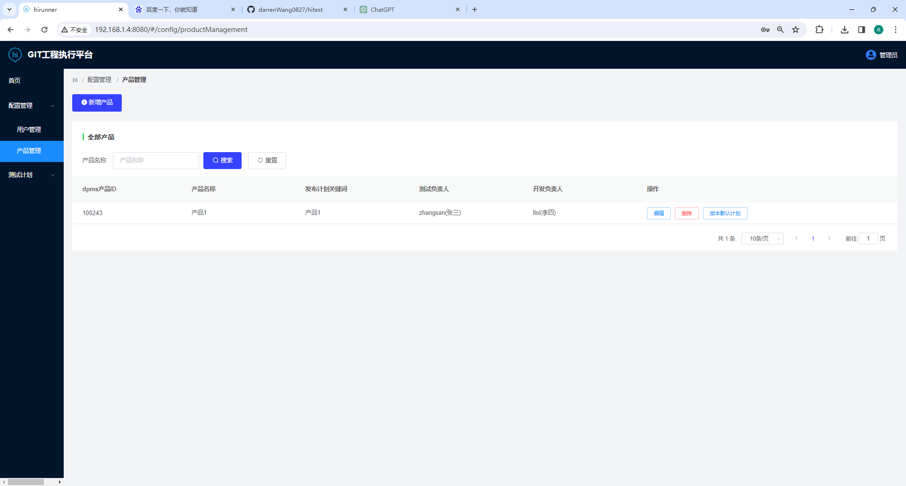
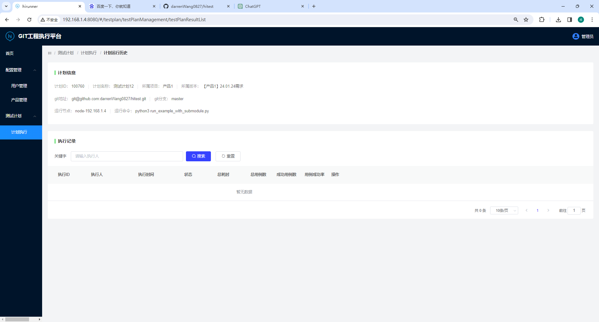

# hirunner-backend

## 安装部署说明  
本代码未完全调试完，请自行调试，并变化对应的配置内容
### 下载代码，并安装依赖
部分依赖模块写在requirements.txt中，并不完全，请自行调试并安装

### 初始化建库并导入初始化表和数据
建库: hirunner
初始化表和数据sql文件：deploy/dump-hirunner-init.sql


### 安装或配置jenkins  
安装步骤略，请自行百度  
流水线配置:  
1.新建一个pipeline流水线，名称为hirunner_run_python_job  
2.新建字符参数NODE，默认值为node-19.168.1.9(请自行根据情况变化,需要自行新建jenkins节点，并配置默认并行任务数来增加并发量)  
3.新建字符参数GIT_REPOSITORY，默认值为你的git主工程地址  
4.新建字符参数GIT_NAME，默认值为你的git主工程的git名称，如hitest  
5.新建字符参数GIT_BRANCH，默认为你的git主工程的master分支  
6.新建字符参数RUNNER_DIR，默认为你的默认运行节点的D:/jenkins/hirunner/1/  
7.新建字符参数GIT_PULL,默认值为true  
8.新建字符参数SRC_DIR,默认值为D:/jenkins/hirunner/1/hitest  
9.新建字符参数RUN_CMD,默认值为python3 run_test.py  
10.新建文本参数EXECUTE_INFO,默认值为{"execute_id":"0"}  
11.在高级项目选项中的流水线，定义选择Pipeline script  
&nbsp;&nbsp;&nbsp;&nbsp;脚本内容填写为  deploy/hirunner_run_python_job.pipeline  
运行节点配置:  
请自行查找资料解决


### redis(可选)
略，请自行百度  

### 运行django并调试
```python
python3 manage.py runserver 0.0.0.0:8000
```

### api接口文档使用
访问：http://localhost:8000/swagger/  
用户密码：admin/qa123456

### gunicorn托管  
详细步骤请百度，提供django应用程序的：gunicorn_conf配置文件，后端代码部署开机启动的gunicorn.service文件、jenkins agent的开机启动管理hirunneragent.service文件   
1.建立systemd管理gunicorn服务  
```shell
ln -s /data/app/hirunner-backend/deploy/gunicorn.service /etc/systemd/system/gunicorn.service
```  
2.启动/停止/重启
```shell
systemctl start/stop/restart gunicorn
```  
3.设置开机启动
```shell
systemctl enable gunicorn  
```
### nginx部署前后端分离  
前端代码在：https://github.com/darrenWang0827/hirunner-frontend.git  
nginx.conf主要内容如下：  
```shell
server {  
    ...  
    # 后端接口
    location /api/ {  
    proxy_pass http://192.168.1.4:8000/api/;  
        proxy_set_header X-Forwarded-For $proxy_add_x_forwared_for;  
        proxy_set_header X-Real-IP $remote_addr;  
        proxy_set_header Host $http_host;
    }  
    # 前端文件
    location / {  
        root /data/app/hirunner-frontend/dist/;  
        index index.html index.htm;  
        proxy_read_timeout 1000;  
    }  
}
```
### 效果图  
1.登录  

2.产品管理  
  
3.计划管理  
 
4.执行历史记录  
